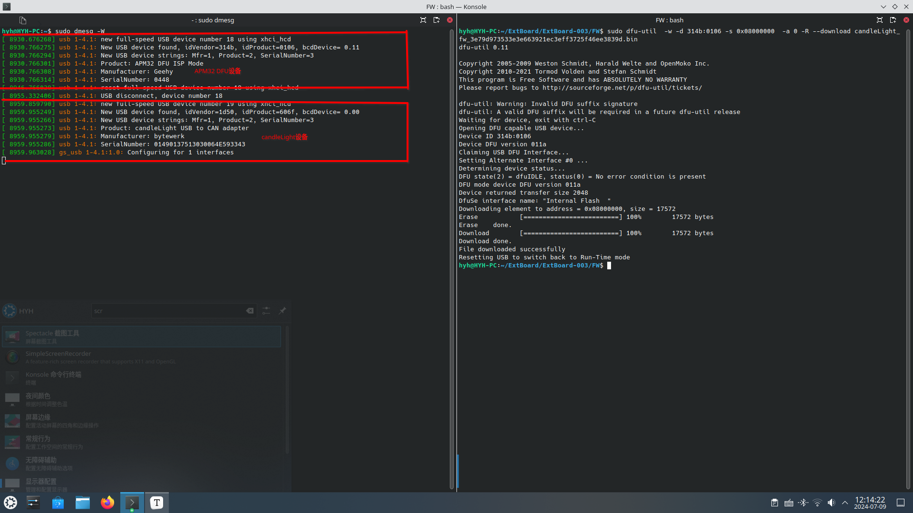

# 说明

此处提供成品固件。

固件源代码可见candleLight官方固件，查看本人fork的分支(作为备份)：

- https://github.com/HEYAHONG/candleLight_fw.git
- https://gitee.com/HEYAHONG/candleLight_fw.git

固件列表:

- [candleLight_fw_3e79d973533e3e663921ec3eff3725f46ee3839d.bin](candleLight_fw_3e79d973533e3e663921ec3eff3725f46ee3839d.bin)

# 固件烧录

对于已经烧录固件的硬件，candleLight可采用DFU方式升级。

对于未烧录固件的硬件的用户，可采用以下方式烧录固件:

- 芯片内嵌Bootloader自带的DFU烧录。
- 采用SWD调试接口烧录,可使用各种调试器/烧录器,。

其中推荐采用使用芯片Bootloader自带的DFU烧录,只需要在上电时拉高Boot0引脚即可。

## 使用芯片内嵌Bootloader的DFU烧录(官网工具)

### 准备工作

安装好以下工具(资源下载在极海官网的[APM32F072](https://geehy.com/product/fifth/APM32F072#document)介绍页):

- [GeehyProg SetUp](https://geehy.com/uploads/tool/GeehyProg_V1.0.2_Chinese.msi)
- [DFU驱动安装](https://geehy.com/uploads/tool/dfu驱动安装.zip)

### 进入内嵌Bootloader

拉高Boot0(只需要短接板上的Boot即可)。将硬件通过USB连接至计算机。


### 烧录


### 烧录完成

烧录完成后并重新上电后，可在设备管理器中找到candleLight设备。


## 使用芯片内嵌Bootloader的DFU烧录(dfu-util)

对于非Windows用户，可使用[dfu-util](http://dfu-util.sourceforge.net/
)烧录APM32F072。

本段落以ubuntu24.04下的操作为例，主要分为以下步骤：

- 短接Boot0，使用USB连接计算器。
- 执行dfu命令:

```bash
#firmware.bin需要替换为实际的固件程序
sudo dfu-util  -w -d 314b:0106 -s 0x08000000  -a 0 -R --download firmware.bin
```

- 重新上电



