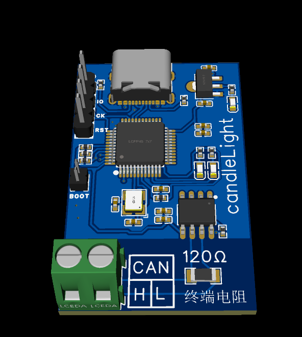

# 说明

为减少成本，硬件并未进行ESD防护。一般仅用于原理验证，生产环境请谨慎使用。

# 文件说明

## 2024-07-01

### 立创EDA(专业版)工程

[ProProject_ExtBoard-003_2024-07-01.epro](ProProject_ExtBoard-003_2024-07-01.epro)

### 原理图

[SCH_Schematic-CandleLight_2024-07-01.pdf](SCH_Schematic-CandleLight_2024-07-01.pdf)

注意:具体原理图请查看立创EDA(专业版)工程。

### PCB

注意:具体PCB板请查看立创EDA(专业版)工程。