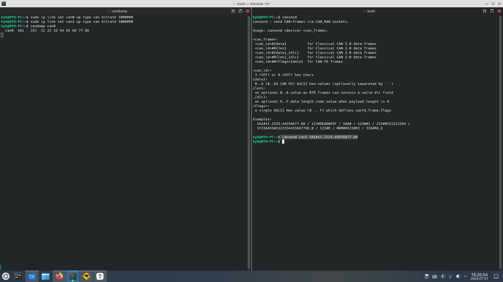

# 说明

USB转CAN适配器。复刻candleLight。

原工程信息:

- 固件:https://github.com/candle-usb/candleLight_fw.git
- 硬件:https://github.com/HubertD/candleLight.git

# 测试

本段落中采用一对ExtBoard-003测试。操作系统为ubuntu24.04,工具采用[can-utils](https://github.com/linux-can/can-utils)测试。

- 打开can接口。

  ```bash
  #打开can0
  sudo ip link set can0 up type can bitrate 1000000
  #打开can1
  sudo ip link set can1 up type can bitrate 1000000
  ```

  

- 使用candump在一个适配器上读取数据。

  ```bash
  candump can0
  ```

  

- 使用cansend在另一个适配器上发送数据。

  ```bash
   #发送测试数据
   cansend can1 5A1#11.2233.44556677.88
  ```




# 目录结构

- [HW](HW):硬件设计。
- [FW](FW):固件。

